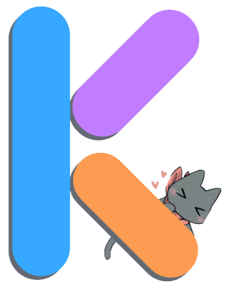
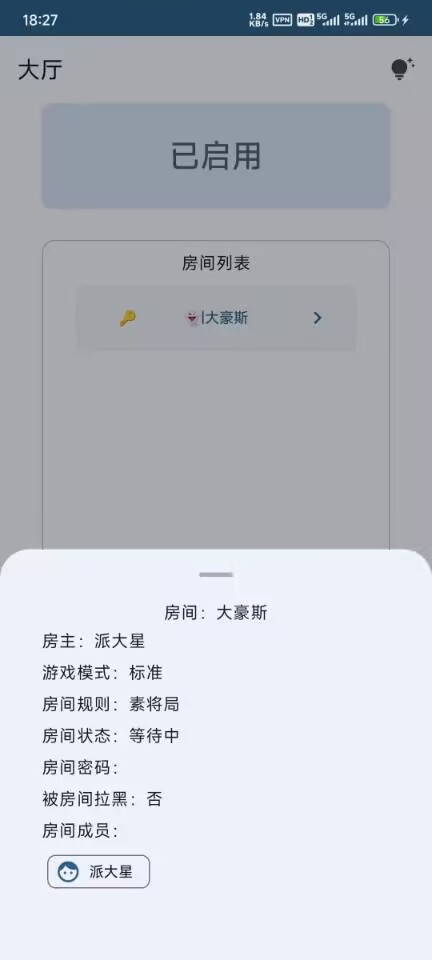
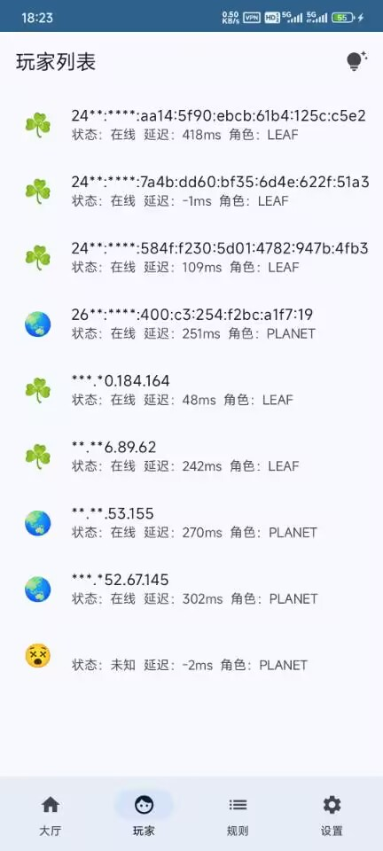
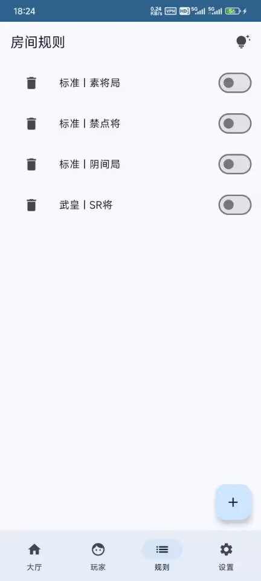
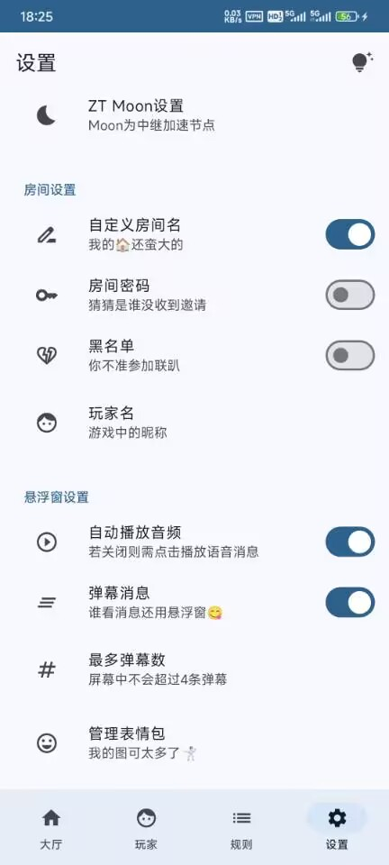

# kill联机助手

## 简介

    

kill联机助手基于zerotier的网络组网，可以使kill联机玩家同处于一个虚拟局域网内，实现局域网联机。在此基础之上，还专门为联机玩家提供了一些有趣的功能。

## 基础功能

- [x] 加入联机网络🥳
- [x] 展示玩家列表🥳
- [X] 展示房间列表🥳
- [X] 查看房间详情和房间状态🥳
- [x] 踢人🥳
- [X] 创建房间规则🥳
- [x] 房间密码🥳

## 拓展功能

- [x] 发送弹幕消息🥳
- [x] 发送文字🥳
- [x] 发送语音🥳
- [x] 发送和展示表情包===>自定义展示位置🥳
- [X] 房间设置===>自定义房间名、房间黑名单🥳
- [x] 高级网络设置===>支持moon中转服务器🥳
- [x] 支持房主对聊天进行控制🥳

---

## 待优化问题

- [x] 软件体积优化🥳
- [ ] UI动画优化
- [ ] 首页启动速度优化
- [ ] 表情包卡顿问题
- [ ] 增强软件稳定性

## 功能展示

### 应用界面

  
  
  
 

### 悬浮窗界面

  
  
  
 

## 捐赠

感谢支持🥰🥰🥰

### 爱发电

[爱发电主页](https://afdian.com/a/msk007 "爱发电")